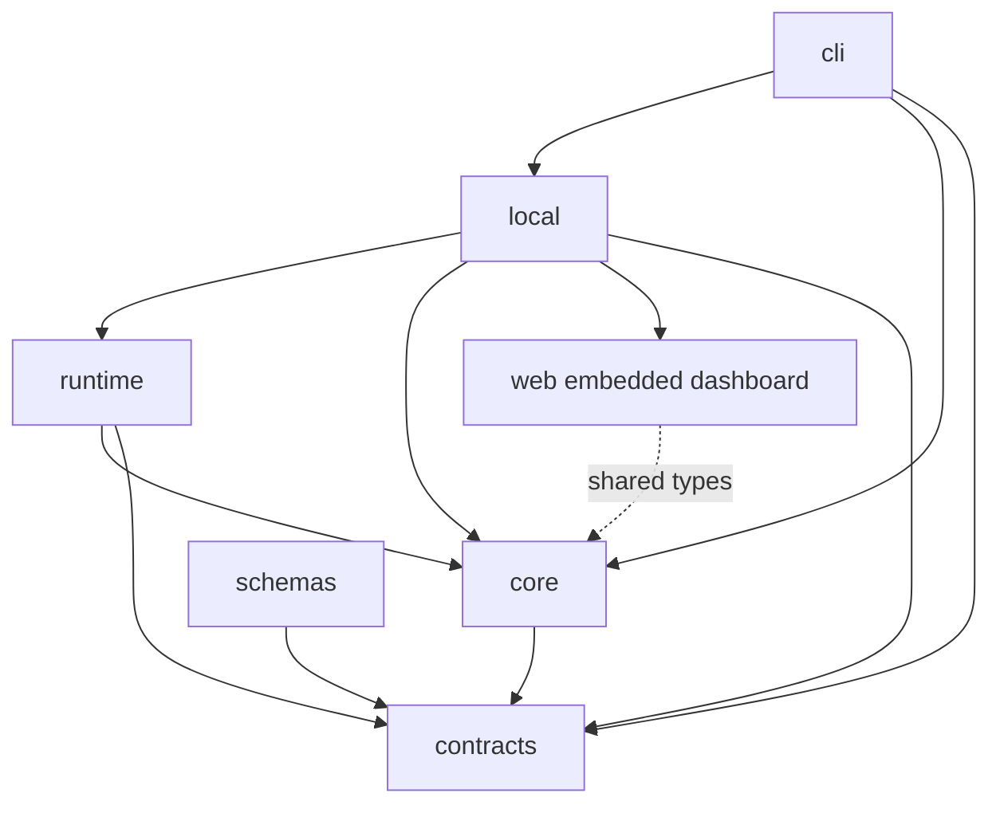

# Package architecture

Attest separates domain logic from execution and local application state. Package ownership follows what a caller needs to do. A hosted application can evaluate agents without importing a loopback server, a project directory, or Commander.

## Domain and protocols

`@attest/contracts` defines the versioned data exchanged with agents, metrics, projects, and machine clients. Zod schemas own these types. Validate untyped input when it enters the system; typed application code should use the resulting discriminated unions directly.

`@attest/core` owns run records and storage interfaces, comparison rules, tabular import transformations, and trace conversion. It does not open databases, spawn processes, call providers, or start HTTP servers. Synchronous content hashing uses the standard crypto implementation. Core is reusable on compatible server runtimes; the browser imports only the types it needs.

Storage interfaces describe existing operations, not a proposed cloud repository framework. Keep durable records independent of the SQLite implementation so another host can implement the same operations when it has a concrete need.

## Execution

`@attest/runtime` invokes agents, evaluates metrics, and schedules evaluation cases. It owns cancellation, deadlines, output limits, process cleanup, and provider calls. Runtime receives persistence and artifact behavior through the existing evaluation interfaces.

Runtime must not import local or CLI. A hosted worker can supply its own persistence and resource setup while retaining the same execution rules. A process-based agent still requires a host capable of running processes; package separation does not make it executable inside a Cloudflare Worker.

## Local application

`@attest/local` discovers and loads project files, applies transactional resource changes, resolves local execution configuration, records runs in SQLite, writes artifacts, and serves the dashboard on loopback. It composes core and runtime with the filesystem and database.

Application errors carry typed codes and context. The CLI owns terminal rendering and exit presentation. Local must not import Commander or the CLI package. Paths, locks, cancellation registries, and the SQLite driver stay here rather than leaking into core types.

Local exposes focused entry points: `/agent`, `/metric`, `/test`, `/project`, `/eval`, `/runs`, `/store`, and `/view-server`. Its root exports application errors and result types.

`@attest/cli` translates flags and interactive answers into application requests. Its public entry point runs the CLI. It is not the SDK for project loading, eval execution, or persistence.

## Browser and artifacts

`@attest/web` supplies the same dashboard for the live local server and static reports. Domain types come from core through type-only imports. Browser code must not import runtime, local, CLI, or Node modules.

`@attest/schemas` publishes generated JSON Schema files. Its validation command checks both the file set and exact content against contracts. `@attest/site` remains a separate marketing page with no application dependencies.

## Adding cloud later

Add cloud code where the deployment needs it. Reuse contracts and core; use runtime in execution workers with the necessary process or network capabilities. Implement storage and artifact adapters against actual cloud services. Do not import local to obtain a domain type or a comparison function.

Authentication, tenant boundaries, queues, and object storage belong to that deployment. They are not hidden inside the local dashboard server. No cloud package, transport facade, or generic plugin registry is needed before that work begins.

## Checking boundaries

ESLint rejects execution and local infrastructure imports in core, local or CLI imports in runtime, CLI or Commander imports in local, and server imports in web. Workspace manifests and TypeScript references make the dependency graph explicit. Run the root build, typecheck, lint, and tests after moving an API across packages.
