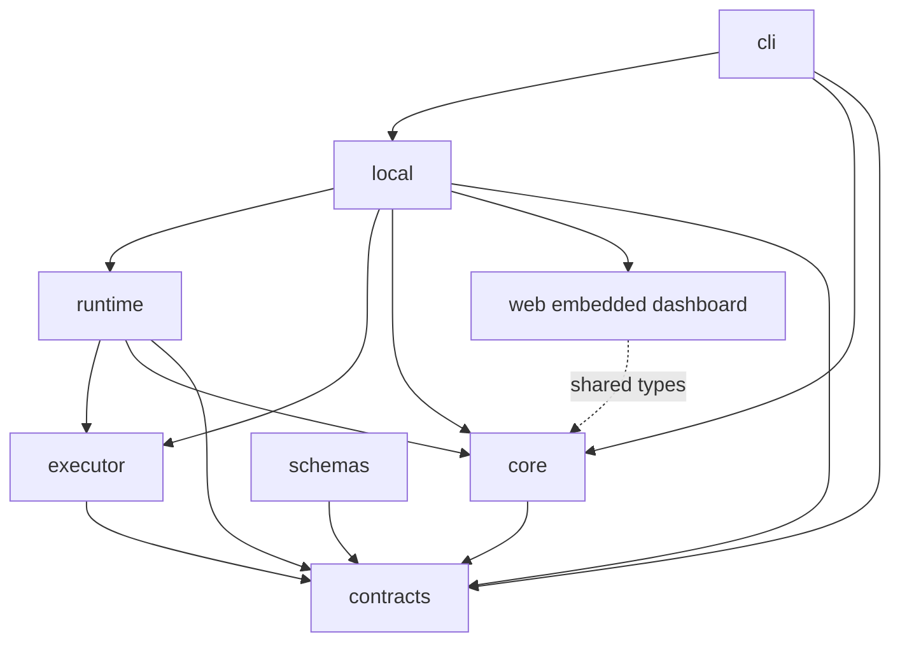

# Package architecture

Attest separates domain logic from execution and local application state. Package ownership follows what a caller needs to do. A hosted application can evaluate agents without importing a loopback server, a project directory, or Commander.

```mermaid
graph TD
  CLI[cli] --> Local[local]
  Local --> Runtime[runtime]
  Local --> Executor
  Local --> Core[core]
  Local --> Web[web embedded dashboard]
  Runtime --> Executor[executor]
  Executor --> Contracts
  Runtime --> Core
  Core --> Contracts[contracts]
  Runtime --> Contracts
  Local --> Contracts
  CLI --> Core
  CLI --> Contracts
  Web -. shared types .-> Core
  Schemas[schemas] --> Contracts
```

## Domain and protocols

`@attest/contracts` defines the versioned data exchanged with agents, metrics, projects, and machine clients. Zod schemas own these types. Validate untyped input when it enters the system; typed application code should use the resulting discriminated unions directly.

`@attest/core` owns run records and storage interfaces, comparison rules, tabular import transformations, trace conversion, and case selection. The core `selectCases` function applies case/tag/folder/dataset
filters and seeded sampling before runtime scheduling. Contracts own selection schemas; local
expands authored cases and freezes the selected identities and coverage in each run. Core owns
partial-run comparison rules. It does not open databases, spawn processes, call providers, or start HTTP servers. Synchronous content hashing uses the standard crypto implementation. Core is reusable on compatible server runtimes; the browser imports only the types it needs.

Storage interfaces describe existing operations, not a proposed cloud repository framework. Keep durable records independent of the SQLite implementation so another host can implement the same operations when it has a concrete need.

## Execution

`@attest/executor` invokes agents through CLI, HTTP, streaming, persistent sessions, and Vercel Sandbox. It owns invocation retries, transport deadlines, output limits, process cleanup, and case environments. It imports contracts, never runtime, core, local, or CLI. Its compiled ESM runs on Node 22+ and Bun 1.4+.

`@attest/runtime` evaluates metrics and schedules evaluation cases. It owns eval lifecycle hooks and case environment lifetime, and imports executor for invocation types. An `EvalCaseRunner` awaits stage callbacks between agent work and evaluation. Ordered hook arrays and injected environment factories let applications add behavior without replacing the scheduler. Runtime receives persistence and artifact behavior through the existing evaluation interfaces.

Runtime must not import local or CLI. A hosted worker can supply its own persistence and resource setup while retaining the same execution rules. A process-based agent still requires a host capable of running processes; package separation does not make it executable inside a Cloudflare Worker.

## Local application

`@attest/local` discovers and loads project files, applies transactional resource changes, resolves local execution configuration, records runs in SQLite, writes artifacts, and serves the dashboard on loopback. It composes core and runtime with the filesystem and database.

Application errors carry typed codes and context. The CLI owns terminal rendering and exit presentation. Local must not import Commander or the CLI package. Paths, locks, cancellation registries, and the SQLite driver stay here rather than leaking into core types.

Local exposes focused entry points: `/agent`, `/metric`, `/test`, `/project`, `/eval`, `/runs`, `/store`, and `/view-server`. Its root exports application errors and result types.

`@attest/cli` translates flags and interactive answers into application requests. Its public entry point runs the CLI. It is not the SDK for project loading, eval execution, or persistence.

## Browser and artifacts

`@attest/web` supplies the same dashboard for the live local server and static reports. Domain types come from core through type-only imports. Browser code must not import runtime, local, CLI, or Node modules.

`@attest/schemas` publishes generated JSON Schema files. Its validation command checks both the file set and exact content against contracts. `@attest/site` remains a separate marketing page with no application dependencies.

## Adding cloud later

Add cloud code where the deployment needs it. Reuse contracts and core; use runtime in execution workers with the necessary process or network capabilities. Implement storage and artifact adapters against actual cloud services. Do not import local to obtain a domain type or a comparison function.

Authentication, tenant boundaries, queues, and object storage belong to that deployment. They are not hidden inside the local dashboard server. No cloud package, transport facade, or generic plugin registry is needed before that work begins.

## Checking boundaries

ESLint rejects runtime/application dependencies in executor, execution and local infrastructure imports in core, local or CLI imports in runtime, CLI or Commander imports in local, and server imports in web. Workspace manifests and TypeScript references make the dependency graph explicit. Run the root build, typecheck, lint, and tests after moving an API across packages.

Executor APIs such as `invokeAgent`, transport sessions, and process cleanup are imported from `@attest/executor`. Runtime does not re-export them. Consumers using their former runtime exports must update imports and add the executor dependency. `CaseExecution` is imported from `@attest/runtime`, which assembles it from invocation results.

## Portable projects

`PortableProjectBundle` carries the existing `ProjectResources` snapshot plus UTF-8 authored
files. `resolvePortableProject` checks source/resource equality and manifest hashes before a host
persists a revision. Paths are limited to the canonical `attest.project.json` and `attest/` layout;
extra source files belong under `attest/metrics/code/`. Bundles allow at most 100 files, 1 MiB per
file and 5 MiB total. Credential-bearing HTTP fields require environment secret references.
Arbitrary dataset text and source code are user content; these checks do not detect embedded
secrets in arbitrary strings. Static source checks reject direct third-party and relative imports. TypeScript accepts node-prefixed
built-ins and bun; Python accepts the documented safe standard-library subset in
`portable-metric-source.ts`. These checks are a convenience preflight. They do not prove dependency closure and are not a security boundary. Sandbox isolation and runtime import errors remain authoritative. Hosts must return actionable metric errors for missing dependencies.
Cloud capability validation must reject unsupported execution hooks before accepting a run.

Core owns pure `resolveEvalRun`, dataset expansion, metric overrides, and canonical project
hashing. Local supplies loaded resources and maps domain errors into its application errors.
Cloud resolves the same resources from a validated bundle. Authentication, service response
envelopes, queue persistence, quotas, and retention remain deployment-owned.

Cloud revision identity must include the full bundle, including metric source bytes. The core
`projectHash` intentionally retains local manifest semantics and does not identify bundled source
files. Persist a full-bundle content hash and revision ID in cloud run provenance.

## Hosted transport injection

`@attest/executor/http` exports HTTP-only invocation and host transport hooks.
It does not eagerly import process or sandbox implementations. Hosted callers
supply guarded fetch through `createFetchHttpTransports` and set `retries: 0` for
mapped and streaming invocations. Native `invokeNativeHttpAgent` always records
one validated attempt. The host owns DNS pinning and tenant endpoint policy;
shared adapters own mapping, polling, stream parsing, caps and cancellation.
Workers using this entry point require `nodejs_compat` for crypto, util and Buffer.

`evaluateMetrics` accepts `exec.commandTransport` to execute custom commands in
a host-owned isolated environment. The transport receives the existing metric
request JSON and normalized timeout, output cap and cancellation options. It
returns bounded response text or a typed metric error. Runtime retains result
contract validation and scoring. The local command implementation loads only
when no custom command transport is supplied.
